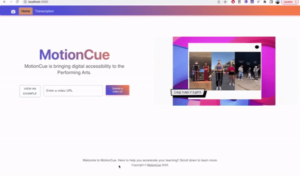

<h1 align=center> MotionCue </h1>
QHack 2023 submission. MotionCue is a motion annotation solution that "transcribe" movement to text.

See more details in our Devpose: [link](https://devpost.com/software/danse-scription)

# Architecture Design

# Resources
## Training our model
- https://opencv.org/
- https://scikit-learn.org/stable/modules/ensemble.html#forest
- https://google.github.io/mediapipe/solutions/pose
## Inspecting our data
- Tensorflow pre-trained models - https://github.com/tensorflow/tfjs-models
## Displaying to our ui
- https://github.com/u-wave/react-youtube
- https://mui.com/material-ui/getting-started/installation/
- tabs - https://reactcommunity.org/react-tabs/
## Texts on pose detection
- https://www.americananthro.org/ImageDescriptions?navItemNumber=25126
- https://www.cs.ubc.ca/~lsigal/Publications/SigalEncyclopediaCVdraft.pdf
